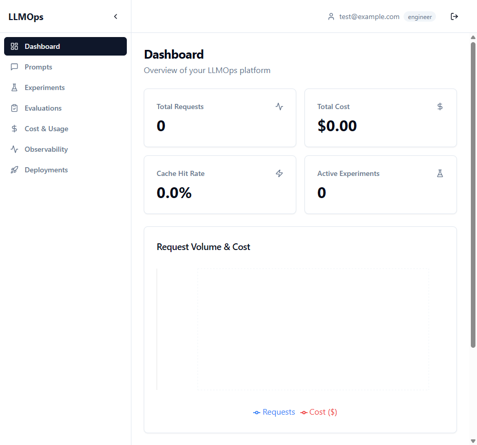
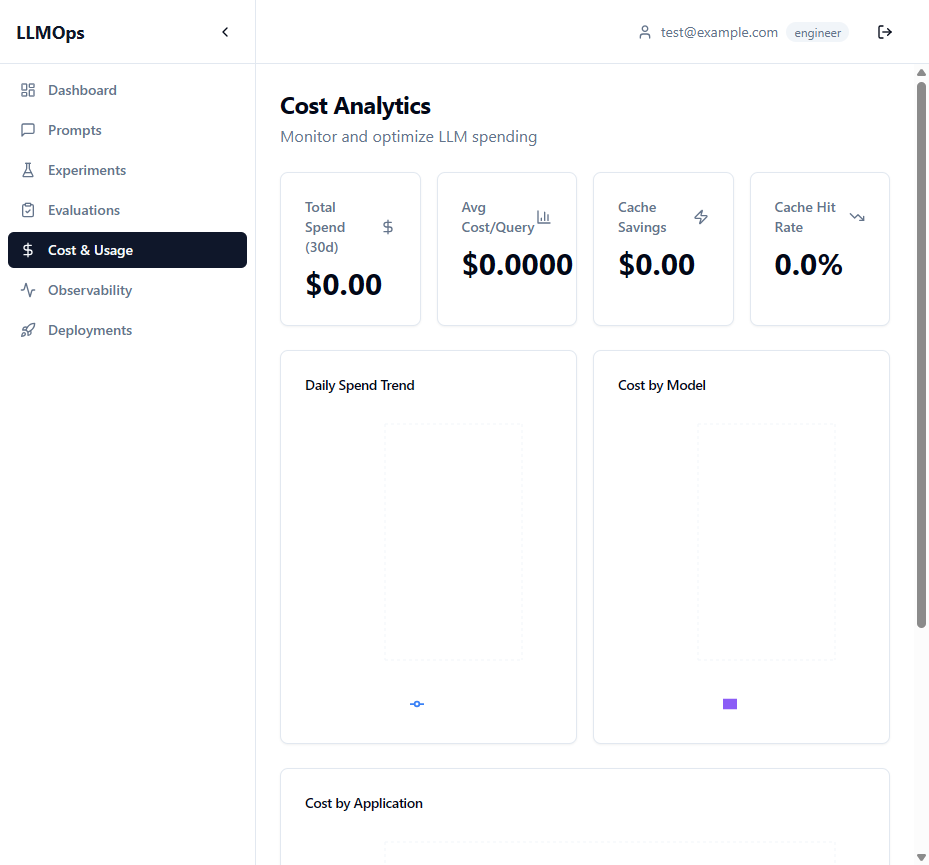
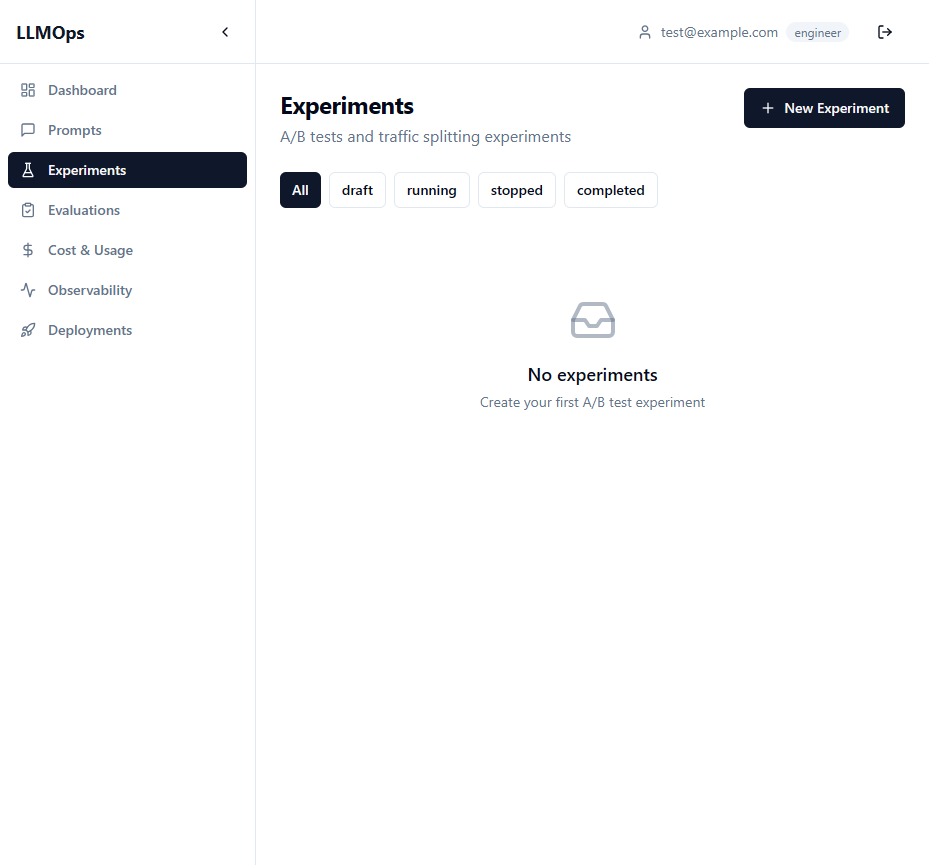
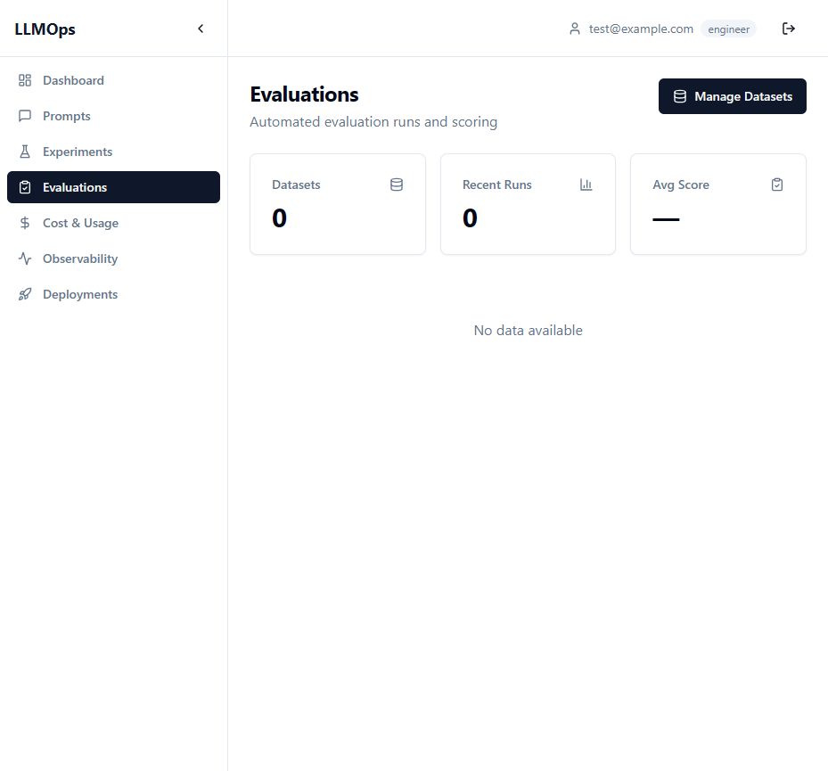
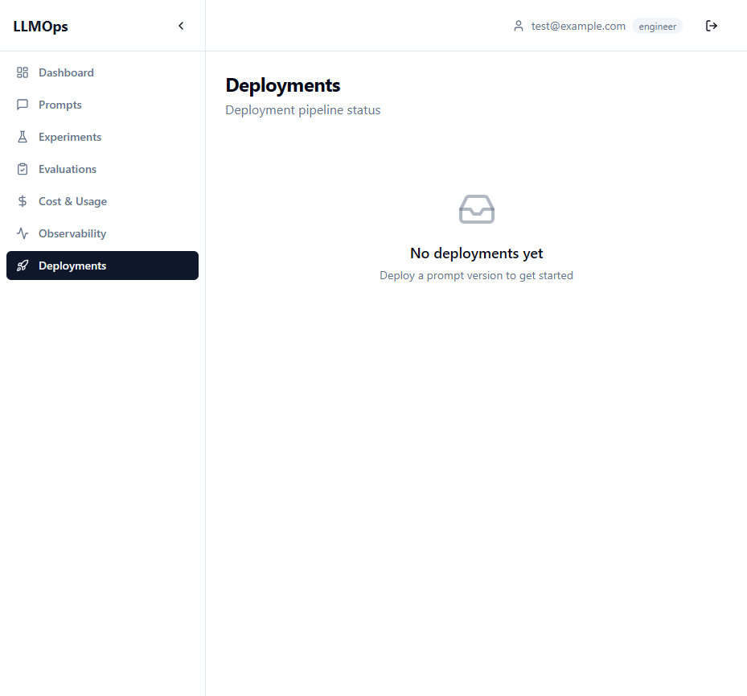
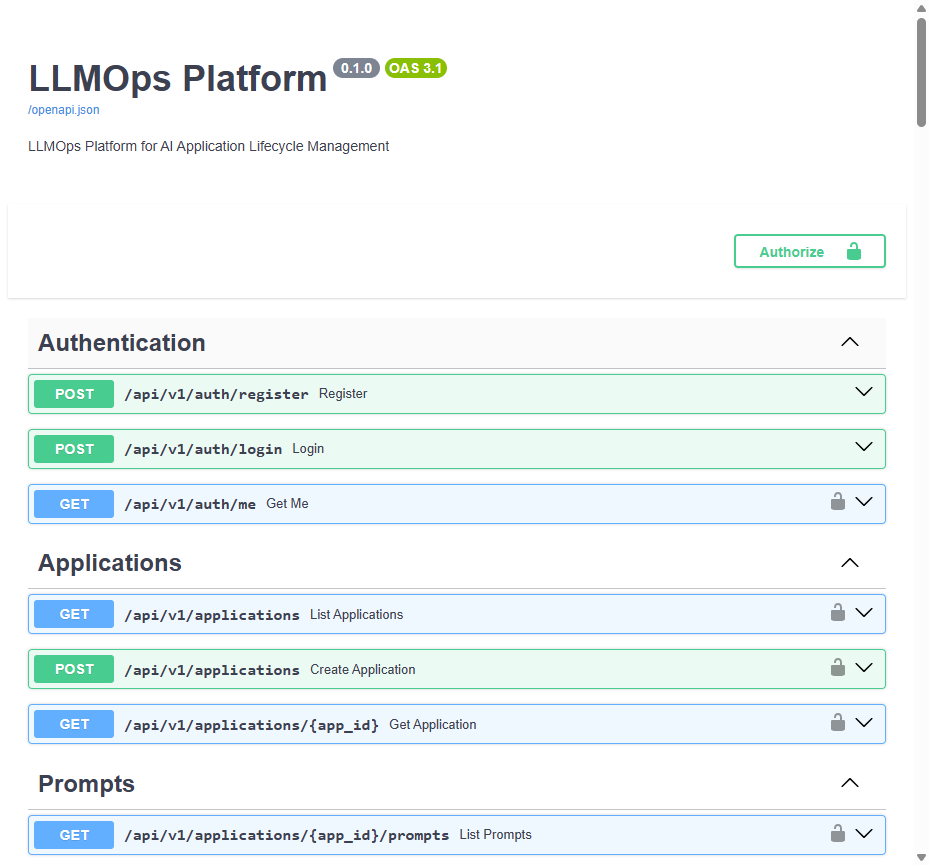

# LLMOps Platform

**DevOps for LLM Applications** — the same discipline of testing, monitoring, and safe deployment that software teams use for code, applied to prompts and AI behavior.

Teams building LLM-powered applications hit a wall when they move from prototype to production. Prompts get managed through Slack messages and Google Docs. A "small tweak" improves one use case but silently breaks three others. Costs spiral because every query — even simple FAQs — goes to the most expensive model. When users report bad responses, nobody can trace what happened. And every prompt change goes to 100% of traffic with no safety net.

This platform solves all of that. It gives AI/ML teams a unified interface to **version and A/B test prompts**, **run automated and human evaluations**, **route queries to the cheapest model that can handle them**, **trace every LLM call in production**, and **deploy changes safely through eval-gated CI/CD pipelines with canary rollouts**.

```
Prompt Edit → Run Evals → Quality Gate → Canary (10%) → Monitor → Full Rollout
```

### Screenshots

| Dashboard | Cost Analytics |
|:---------:|:--------------:|
|  |  |

| Experiments (A/B Testing) | Evaluations |
|:-------------------------:|:-----------:|
|  |  |

| Deployments | API Documentation |
|:-----------:|:-----------------:|
|  |  |

---

## What Problems Does It Solve?

| Problem | Without This Platform | With This Platform |
|---------|----------------------|-------------------|
| **Prompt Chaos** | Prompts live in Slack, Docs, and local files. Nobody knows what's in production or how to roll back. | Version-controlled prompts with full history, diff views, and one-click rollback. |
| **Silent Quality Regressions** | A prompt tweak breaks edge cases that nobody catches until users complain. | Eval suites run on every change and block deployment if quality drops below thresholds. |
| **Uncontrolled Costs** | Every query uses the most expensive model. A $15/M-token model answers simple FAQs. | Intelligent routing sends simple queries to cheaper models. Cost dashboards show spend per app. |
| **No Production Visibility** | When something goes wrong, there's no trace of which prompt, model, or parameters were used. | Full request traces with latency, tokens, cost, and quality signals for every LLM call. |
| **Risky Deployments** | Prompt changes go straight to 100% of traffic. If it breaks, every user is affected. | Canary rollouts start at 10%, auto-rollback on quality degradation, gradual ramp to 100%. |

---

## Who Is It For?

- **AI/ML Engineers** — Build and iterate on prompts, write eval datasets, configure model routing, monitor production quality
- **Prompt Engineers / AI Product Managers** — Design prompt strategies, run A/B tests, review eval results, decide which version ships
- **Engineering Managers** — High-level visibility into cost trends, quality scores, and error rates across AI applications
- **Human Evaluators** — Domain experts who rate LLM responses for quality during evaluation campaigns

---

## How It Works

The platform sits between your LLM-powered applications and the LLM providers (OpenAI, Anthropic, etc.). Your applications call the platform's **Gateway API** instead of calling LLM providers directly. The platform then manages everything in between — which prompt to use, which model to route to, whether to serve a cached response, and how to trace the result.

### The Core Loop

**1. Author prompts in a central registry** — Engineers write prompt templates with variables like `{{user_question}}` and `{{context}}` in a Monaco-based editor. Every edit is versioned with full diff history. Prompts are tagged as `experimental`, `staging`, or `production`.

**2. Test before anyone sees it** — Try prompts interactively in a built-in playground with sample inputs. Then run automated evaluation suites against golden datasets (curated Q&A pairs) and adversarial datasets (edge cases). The platform scores responses on factuality, relevance, safety, format compliance, and latency — plus any custom metrics you define in Python.

**3. Gate deployments on quality** — When a prompt is ready, the CI/CD pipeline compares eval scores against the current production baseline. If any metric drops below a configurable threshold, deployment is blocked. No manual review needed for the go/no-go decision — the eval results decide.

**4. Roll out gradually** — Approved changes deploy as a canary to 10% of traffic. The platform monitors quality metrics in real time. If scores hold, traffic ramps to 25% → 50% → 100%. If quality degrades at any stage, the platform automatically rolls back to the previous version.

**5. Optimize costs continuously** — Not every query needs the most expensive model. The platform's routing engine sends simple queries (FAQs, lookups) to cheaper models and reserves expensive models for complex reasoning. A semantic cache returns stored responses for near-duplicate queries without calling the LLM at all.

**6. Observe everything** — Every LLM call is traced end-to-end: the rendered prompt, raw response, latency, token count, cost, and eval scores. Pre-built Grafana dashboards surface request volume, latency distributions, error rates, cost trends, and quality over time. Alerts fire when metrics breach thresholds.

### Running an A/B Test

Select 2+ prompt variants, set a traffic split (e.g., 50/50), and define a duration. Production requests are automatically routed to variants. A live dashboard compares quality, latency, and cost across variants. The platform calculates statistical significance (Welch's t-test, default p < 0.05). Once a winner is confirmed, one click promotes it to production.

### Human Evaluation

For subjective quality that automated metrics can't capture, create evaluation campaigns. Assign domain experts (e.g., a support lead rating support responses) to a queue of LLM outputs. Evaluators rate responses on configurable dimensions (helpfulness, accuracy, tone) or do blind side-by-side comparisons. The platform tracks inter-rater agreement to ensure scoring consistency.

---

## Features

### Prompt Management
- Version-controlled prompt templates with Jinja2 syntax
- Monaco-based editor with `{{variable}}` highlighting
- Side-by-side diff comparison between versions
- Tag management (production, staging, experimental)
- Interactive playground for testing prompts

### A/B Testing
- Create experiments with multiple prompt variants
- Configurable traffic splitting
- Real-time results with statistical significance (Welch's t-test)
- Automatic winner detection and promotion

### Evaluation Framework
- **5 built-in evaluators**: Factuality, Relevance, Safety, Format Compliance, Latency
- Extensible evaluator registry with `BaseEvaluator` interface
- Golden and adversarial dataset management
- Human evaluation campaigns with blind rating interface
- Automated eval runs via Celery workers

### LLM Gateway
- Unified proxy endpoint (`POST /gateway/chat`)
- **Semantic caching** with Qdrant + sentence-transformers
- **Intelligent model routing** based on complexity, keywords, and custom rules
- Integrated tracing via LangFuse
- Full request logging with token/cost tracking

### Cost Optimization
- Real-time cost analytics by application, model, and time period
- Budget alerts with configurable thresholds
- Cost forecasting based on 7/30 day trends
- Model routing for cost reduction (route simple queries to cheaper models)

### Observability
- **Dual tracing**: LangFuse for LLM traces, OpenTelemetry for infrastructure
- 3 pre-built Grafana dashboards (LLM Overview, Cost Analytics, Quality Trends)
- Custom OTel metrics (request duration, tokens, cost, cache hit ratio, eval scores)
- Configurable alerting rules

### CI/CD & Deployments
- Eval-gated deployment pipeline (GitHub Actions)
- Automated canary rollouts (10% → 25% → 50% → 100%)
- Automatic rollback on quality degradation
- Full deployment audit trail

## Real-World Scenarios

**Improving a support bot's prompt** — An engineer adds conciseness instructions. Automated eval runs 200 test questions: relevance unchanged, conciseness +30%, but factuality dropped 5% on complex queries. They adjust the prompt, re-run eval (all green), and deploy via canary. The regression never reaches users.

**Investigating a cost spike** — A manager gets a budget alert: "Product Search" spend is up 40%. The cost dashboard shows tokens-per-request doubled on Wednesday. Drilling into traces reveals a verbose system message was added. They optimize it and costs drop back down — caught in hours, not at the monthly invoice.

**A/B testing response styles** — A prompt engineer tests bullet-point vs. paragraph answers with a 50/50 split. After 1,000 requests, bullet-points score +0.4 on helpfulness (statistically significant). One click promotes the winner to production.

**Catching a regression automatically** — An engineer pushes a prompt change. The CI/CD pipeline runs evals and detects factuality dropped from 4.2 to 3.6 — below the 3.8 threshold. Deployment is blocked automatically with a link to the failing test cases.

---

## Architecture

```
                         ┌─────────────────────────────────┐
                         │       Your LLM Application      │
                         └──────────────┬──────────────────┘
                                        │  POST /api/v1/gateway/chat
                                        ▼
┌────────────┐          ┌──────────────────────────────────┐          ┌─────────────────┐
│  Frontend  │◄────────►│          FastAPI Backend          │────────►│  LLM Providers  │
│  React UI  │          │                                  │         │  (via litellm)  │
│            │          │  ┌──────────┐  ┌──────────────┐  │         │                 │
│ - Prompts  │          │  │ Gateway  │  │  Eval Engine │  │         │ - OpenAI        │
│ - A/B Tests│          │  │ Service  │  │  (5 metrics) │  │         │ - Anthropic     │
│ - Evals    │          │  └────┬─────┘  └──────┬───────┘  │         │ - 100+ more     │
│ - Cost     │          │       │               │          │         └─────────────────┘
│ - Deploy   │          │  ┌────▼─────┐  ┌──────▼───────┐  │
│ - Observe  │          │  │ Routing  │  │Celery Workers│  │
│            │          │  │ Engine   │  │ (async evals)│  │
└────────────┘          │  └──────────┘  └──────────────┘  │
                         └──────┬────────────┬─────────────┘
                                │            │
              ┌─────────────────┼────────────┼──────────────────┐
              │                 │            │                  │
      ┌───────▼──────┐  ┌──────▼───┐  ┌─────▼──────┐  ┌───────▼───────┐
      │ PostgreSQL   │  │  Redis   │  │   Qdrant   │  │   LangFuse    │
      │              │  │          │  │            │  │               │
      │ - Prompts    │  │ - Cache  │  │ - Semantic │  │ - LLM Traces │
      │ - Versions   │  │ - Queue  │  │   Cache    │  │ - Latency    │
      │ - Eval Data  │  │ - Tasks  │  │ - Vectors  │  │ - Costs      │
      │ - Deploys    │  │          │  │            │  │               │
      └──────────────┘  └──────────┘  └────────────┘  └───────────────┘
                                                              │
                         ┌────────────────────────────────────┘
                         │
              ┌──────────▼──────────┐
              │  Grafana + Prometheus│
              │  + OTel Collector   │
              │                     │
              │ - 3 Pre-built       │
              │   Dashboards        │
              │ - Alerting          │
              └─────────────────────┘
```

---

## Tech Stack

| Layer | Technology |
|-------|-----------|
| Backend | Python 3.12, FastAPI, SQLAlchemy 2.0 (async), Celery |
| Frontend | React 18, TypeScript, Vite, Tailwind CSS, Shadcn/ui |
| Database | PostgreSQL 16 |
| Cache/Queue | Redis 7 |
| Vector DB | Qdrant |
| LLM | litellm (OpenAI, Anthropic, 100+ providers) |
| Tracing | LangFuse + OpenTelemetry |
| Monitoring | Grafana + Prometheus + Tempo |
| Infra | Docker Compose (12 services) |

## Quick Start

### Prerequisites
- Docker & Docker Compose
- (Optional) OpenAI/Anthropic API keys for LLM features

### Setup

```bash
# Clone the repository
git clone <repo-url>
cd llmops-platform

# Copy environment file
cp .env.example .env
# Edit .env with your API keys (OPENAI_API_KEY, ANTHROPIC_API_KEY)

# Start all services
docker compose up -d

# Run database migrations
docker compose exec backend alembic upgrade head

# Seed demo data
docker compose exec backend python scripts/seed_data.py
```

### Access

| Service | URL |
|---------|-----|
| **Frontend** | http://localhost:3000 |
| **API Docs** | http://localhost:8000/docs |
| **LangFuse** | http://localhost:3001 |
| **Grafana** | http://localhost:3002 |

### Demo Credentials
- Admin: `admin@llmops.dev` / `admin123`
- Engineer: `engineer@llmops.dev` / `engineer123`
- Evaluator: `evaluator@llmops.dev` / `evaluator123`

## Project Structure

```
llmops-platform/
├── docker-compose.yml          # 12 services
├── .env.example
├── backend/
│   ├── app/
│   │   ├── main.py             # FastAPI app factory
│   │   ├── config.py           # Pydantic Settings
│   │   ├── database.py         # Async DB session
│   │   ├── models/             # SQLAlchemy ORM models
│   │   ├── schemas/            # Pydantic request/response DTOs
│   │   ├── api/v1/             # Route handlers
│   │   ├── services/           # Business logic layer
│   │   ├── evaluators/         # Eval metric implementations
│   │   ├── workers/            # Celery tasks
│   │   ├── middleware/         # Auth, OTel
│   │   └── telemetry/          # OTel SDK setup
│   └── tests/
├── frontend/
│   └── src/
│       ├── api/                # Typed API client
│       ├── hooks/              # React Query hooks
│       ├── stores/             # Zustand stores
│       ├── components/         # UI components
│       └── pages/              # Route pages
├── grafana/provisioning/       # Pre-built dashboards
├── prometheus/                 # Metrics config
├── otel-collector/             # Trace pipeline
├── tempo/                      # Trace storage
├── scripts/                    # Seed data, sample eval
├── docs/                       # Architecture, runbook
└── .github/workflows/          # CI + eval-gated deploy
```

## API Overview

All endpoints under `/api/v1/`. Authentication via JWT Bearer token.

| Category | Key Endpoints |
|----------|--------------|
| Auth | `POST /auth/register`, `POST /auth/login`, `GET /auth/me` |
| Applications | `GET/POST /applications` |
| Prompts | CRUD templates/versions, tagging, rollback, diff, render |
| Experiments | Create, start/stop, live results, promote winner |
| Evaluations | Datasets, eval runs, human eval campaigns |
| Cost | Analytics, forecasting, budget alerts |
| Deployments | Create, promote (canary), rollback |
| Gateway | `POST /gateway/chat` — unified LLM proxy |
| CI/CD | `POST /cicd/trigger-eval`, `GET /cicd/eval-status/{id}` |

Full API documentation available at http://localhost:8000/docs when running.

## Integration Guide

This platform acts as a proxy between your LLM-powered application and LLM providers. Instead of calling OpenAI/Anthropic directly, your app calls the platform's Gateway API — and the platform handles prompt selection, model routing, caching, tracing, and cost tracking transparently.

### Step 1: Authenticate

```bash
# Register a user (or use the seeded demo accounts)
curl -X POST http://localhost:8000/api/v1/auth/register \
  -H "Content-Type: application/json" \
  -d '{"email": "dev@example.com", "password": "secure_password", "role": "engineer"}'

# Login to get a JWT token
curl -X POST http://localhost:8000/api/v1/auth/login \
  -H "Content-Type: application/json" \
  -d '{"email": "dev@example.com", "password": "secure_password"}'

# Response: {"access_token": "eyJ...", "refresh_token": "eyJ...", "token_type": "bearer"}
```

Use the `access_token` as a Bearer token in all subsequent requests.

### Step 2: Register Your Application

```bash
curl -X POST http://localhost:8000/api/v1/applications \
  -H "Authorization: Bearer $TOKEN" \
  -H "Content-Type: application/json" \
  -d '{"name": "Customer Support Bot", "description": "Handles tier-1 support queries"}'

# Response: {"id": "app-uuid-here", "name": "Customer Support Bot", ...}
```

### Step 3: Create a Prompt Template and Version

```bash
# Create a template
curl -X POST http://localhost:8000/api/v1/applications/$APP_ID/prompts \
  -H "Authorization: Bearer $TOKEN" \
  -H "Content-Type: application/json" \
  -d '{"name": "support-reply", "description": "Generates support responses"}'

# Create a version with Jinja2 template syntax
curl -X POST http://localhost:8000/api/v1/prompts/$TEMPLATE_ID/versions \
  -H "Authorization: Bearer $TOKEN" \
  -H "Content-Type: application/json" \
  -d '{
    "content": "You are a helpful support agent.\n\nCustomer question: {{user_question}}\nContext: {{context}}\n\nProvide a concise, accurate answer.",
    "variables": {"user_question": "string", "context": "string"},
    "tag": "production",
    "commit_message": "Initial support prompt"
  }'
```

### Step 4: Call the Gateway from Your Application

This is the main integration point. Replace your direct LLM API calls with this:

```bash
curl -X POST http://localhost:8000/api/v1/gateway/chat \
  -H "Authorization: Bearer $TOKEN" \
  -H "Content-Type: application/json" \
  -d '{
    "application_id": "app-uuid",
    "prompt_template_id": "template-uuid",
    "variables": {
      "user_question": "How do I reset my password?",
      "context": "Users can reset passwords via Settings > Security > Reset Password."
    },
    "user_id": "end-user-123"
  }'
```

**Response:**
```json
{
  "response": "To reset your password, go to Settings > Security > Reset Password...",
  "model": "gpt-4o-mini",
  "latency_ms": 823,
  "input_tokens": 142,
  "output_tokens": 67,
  "cost_usd": 0.00031,
  "cache_hit": false,
  "trace_id": "trace-abc-123",
  "variant_id": null
}
```

Behind the scenes, the gateway:
1. Resolves the active prompt version (respects A/B test routing if an experiment is running)
2. Renders the Jinja2 template with your variables
3. Checks the semantic cache for similar recent queries
4. Routes to the optimal model based on complexity rules
5. Calls the LLM via litellm and logs the full trace to LangFuse
6. Records cost, tokens, and latency for dashboards

### Step 5: Set Up Evaluations

```bash
# Create a golden dataset
curl -X POST http://localhost:8000/api/v1/eval/datasets \
  -H "Authorization: Bearer $TOKEN" \
  -H "Content-Type: application/json" \
  -d '{"application_id": "app-uuid", "name": "Support Golden Set", "dataset_type": "golden"}'

# Add test cases in bulk
curl -X POST http://localhost:8000/api/v1/eval/datasets/$DATASET_ID/items \
  -H "Authorization: Bearer $TOKEN" \
  -H "Content-Type: application/json" \
  -d '{
    "items": [
      {"input_vars": {"user_question": "How do I reset my password?", "context": "..."}, "expected_output": "Go to Settings > Security..."},
      {"input_vars": {"user_question": "What are your hours?", "context": "..."}, "expected_output": "We are available 24/7..."}
    ]
  }'

# Trigger an eval run
curl -X POST http://localhost:8000/api/v1/eval/runs \
  -H "Authorization: Bearer $TOKEN" \
  -H "Content-Type: application/json" \
  -d '{"prompt_version_id": "version-uuid", "dataset_id": "dataset-uuid", "trigger": "manual"}'

# Check results
curl http://localhost:8000/api/v1/eval/runs/$RUN_ID \
  -H "Authorization: Bearer $TOKEN"

# Response includes: {"aggregate_scores": {"factuality": 4.2, "relevance": 4.5, "safety": 4.8}, ...}
```

### Step 6: Run an A/B Test

```bash
# Create an experiment with two prompt variants
curl -X POST http://localhost:8000/api/v1/experiments \
  -H "Authorization: Bearer $TOKEN" \
  -H "Content-Type: application/json" \
  -d '{
    "application_id": "app-uuid",
    "name": "Concise vs Detailed Replies",
    "variants": [
      {"prompt_version_id": "version-1-uuid", "traffic_pct": 50, "label": "Control"},
      {"prompt_version_id": "version-2-uuid", "traffic_pct": 50, "label": "Concise"}
    ]
  }'

# Start the experiment — gateway will now route traffic to variants
curl -X POST http://localhost:8000/api/v1/experiments/$EXP_ID/start \
  -H "Authorization: Bearer $TOKEN"

# Check live results (repeat until statistically significant)
curl http://localhost:8000/api/v1/experiments/$EXP_ID/results \
  -H "Authorization: Bearer $TOKEN"

# Promote the winner to production
curl -X POST http://localhost:8000/api/v1/experiments/$EXP_ID/promote-winner \
  -H "Authorization: Bearer $TOKEN"
```

### Step 7: Deploy Safely with Canary Rollouts

```bash
# Create a canary deployment (starts at 10% traffic)
curl -X POST http://localhost:8000/api/v1/deployments \
  -H "Authorization: Bearer $TOKEN" \
  -H "Content-Type: application/json" \
  -d '{"prompt_version_id": "new-version-uuid", "canary_pct": 10}'

# Monitor quality, then promote through stages: 10% → 25% → 50% → 100%
curl -X POST http://localhost:8000/api/v1/deployments/$DEPLOY_ID/promote \
  -H "Authorization: Bearer $TOKEN"

# If something goes wrong, rollback instantly
curl -X POST http://localhost:8000/api/v1/deployments/$DEPLOY_ID/rollback \
  -H "Authorization: Bearer $TOKEN"
```

### CI/CD Integration

Use the CI/CD endpoints to gate deployments on eval quality in your GitHub Actions (or any CI system):

```bash
# Trigger eval from CI pipeline
curl -X POST http://localhost:8000/api/v1/cicd/trigger-eval \
  -H "Authorization: Bearer $TOKEN" \
  -H "Content-Type: application/json" \
  -d '{"prompt_version_id": "version-uuid", "dataset_id": "dataset-uuid"}'

# Poll until complete, then check the quality gate
curl http://localhost:8000/api/v1/cicd/eval-status/$RUN_ID \
  -H "Authorization: Bearer $TOKEN"

# Response: {"status": "completed", "quality_gate_passed": true, "aggregate_scores": {...}}
# If quality_gate_passed is false, fail the CI build
```

The quality gate passes when all LLM-judge metrics (factuality, relevance, safety) score >= 3.5 out of 5.

## Observability Dashboards

The platform ships with 3 pre-built Grafana dashboards accessible at `http://localhost:3002` after `docker compose up`:

### LLM Overview Dashboard
- **Request volume** — Requests per minute across all applications and models
- **Latency distribution** — P50/P95/P99 response times (histogram)
- **Error rate** — Failed requests as % of total, broken down by error type
- **Cache hit ratio** — Semantic cache effectiveness over time
- **Active experiments** — Currently running A/B tests with traffic splits

### Cost Analytics Dashboard
- **Daily/weekly/monthly spend** — Stacked by model (GPT-4o, GPT-4o-mini, Claude Sonnet, etc.)
- **Cost per application** — Which apps consume the most budget
- **Token usage trends** — Input vs. output tokens over time
- **Budget utilization** — Current spend vs. configured budget alerts (80%, 100% thresholds)
- **Routing savings** — Estimated cost saved by model routing (cheaper model for simple queries)

### Quality Trends Dashboard
- **Evaluation scores over time** — Factuality, relevance, safety, and format compliance
- **Per-version comparison** — Side-by-side quality metrics for prompt versions
- **Human eval agreement** — Inter-rater consistency for human evaluation campaigns
- **Deployment health** — Canary rollout stages with quality gates

> To view dashboards: run `docker compose up -d`, then open http://localhost:3002 (default credentials: admin/admin).

## How This Compares to Alternatives

| Capability | This Platform | LangSmith | Weights & Biases | PromptLayer |
|-----------|:---:|:---:|:---:|:---:|
| Prompt versioning & registry | Yes | Yes | No | Yes |
| A/B testing with traffic splitting | Yes | No | No | No |
| Automated eval (5 built-in metrics) | Yes | Yes | Partial | No |
| Human evaluation campaigns | Yes | Partial | No | No |
| Eval-gated CI/CD pipeline | Yes | No | No | No |
| Canary deployments with auto-rollback | Yes | No | No | No |
| Intelligent model routing | Yes | No | No | No |
| Semantic caching (Qdrant) | Yes | No | No | No |
| Cost analytics & budget alerts | Yes | Partial | No | Partial |
| Self-hosted / open source | Yes | No | No | No |

The key differentiator is the **end-to-end deployment pipeline**: most tools handle observability or prompt management, but none combine eval-gated CI/CD, canary rollouts, intelligent routing, and cost optimization in a single self-hosted platform.

## Key Metrics & Success Criteria

| Metric | Target |
|--------|--------|
| A/B test detects statistically significant winner | p < 0.05 on real eval sets |
| Custom eval metric correlation with human judgment | Spearman rho > 0.7 on 100+ samples |
| Cost reduction via model routing | > 30% average cost reduction vs. always-use-best-model |
| CI/CD pipeline catches quality regressions | 100% of intentional regressions blocked |
| Dashboard metric delay | < 30 seconds from request to dashboard visibility |
| Alert latency on quality degradation | < 2 minutes |

## Scope — What This Does NOT Do

- Does not host or serve LLM applications — it manages prompts, evals, and observability for apps running elsewhere
- Does not train or fine-tune models — it works with pre-trained models via their APIs
- Does not replace LLM providers (OpenAI, Anthropic, etc.) — it sits between your app and the provider
- Does not manage application code or business logic — only the LLM-specific layer (prompts, model selection, evaluation)

## License

MIT
